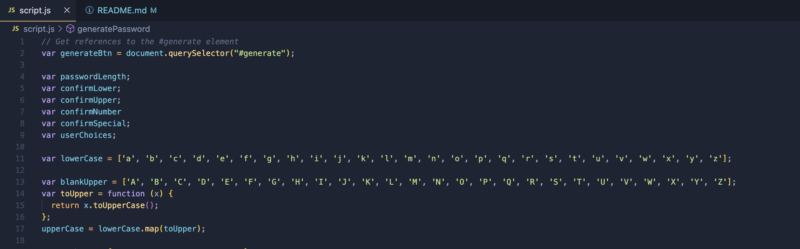
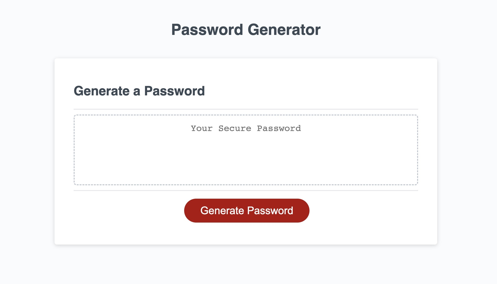

# Password Generator

 This is some of the first JavaScript I have written. This project was aimed to create a Password Generator, which gives an option to choose the length of 8 to 128 characters long. It gives prompts to add uppercase, lowercase, numbers, and special characters, and adds whichever the user selects to the randomly generated password.

# Website Link

https://goobber33.github.io/Password-Generator/

# Installation

Install the index.html, style.css, and script.js and run it in your own IDE. 

# Usage

 A screenshot of some sections of code from my JavaScript for this project. 

Screenshots of the website. The website should resemble this screenshot when deployed.

# Credits

This project was built from "friendly-parakeet" repo from Xandromus, and the JavaScript was added by Kyle Parks.